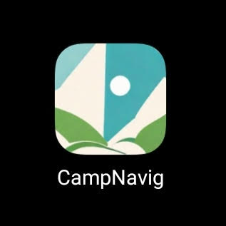
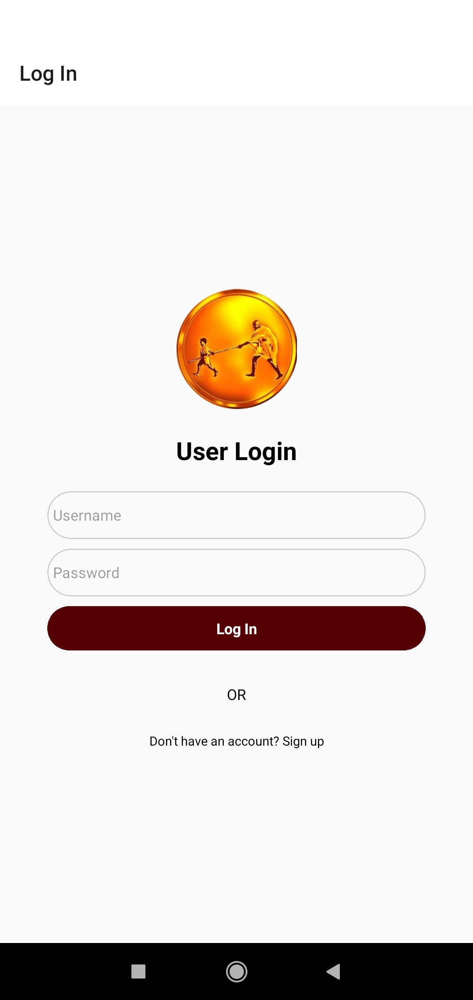
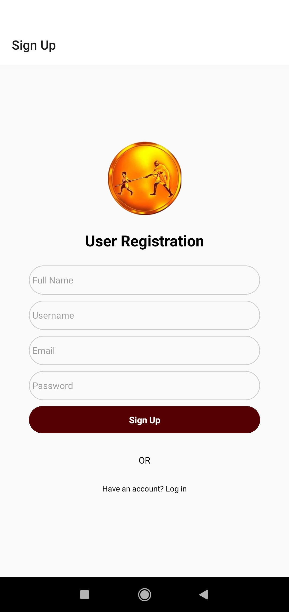
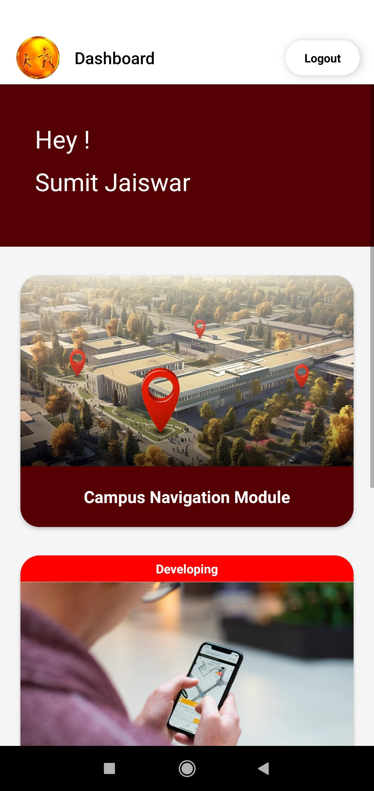
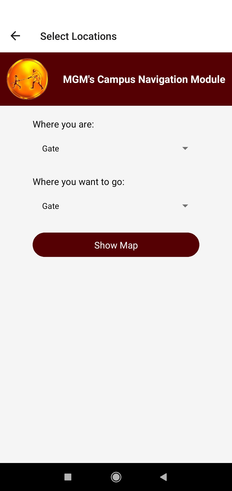
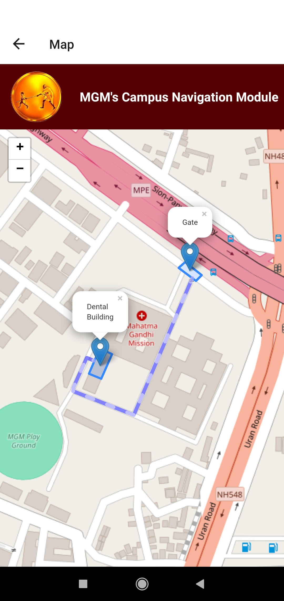
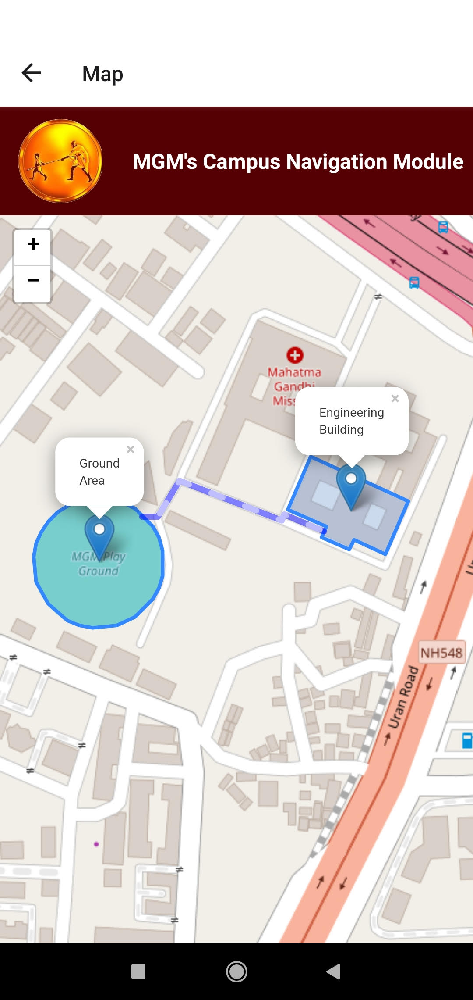
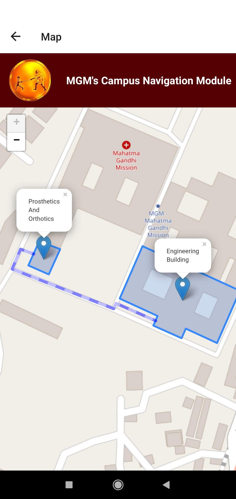

# CampNavig Frontend

CampNavig is a campus navigation app designed specifically for MGM College of Engineering & Technology, Kamothe. The application aims to assist students and visitors in navigating the college campus efficiently. Developed as a final year project by Mr. Sumit Jaiswar and Mr. Harsh Kamble, the app integrates various technologies to provide a seamless and intuitive user experience.

## Table of Contents

- [Screenshot](#screenshot)
- [Features](#features)
- [Technologies Used](#technologies-used)
- [Installation](#installation)
- [Usage](#usage)
- [Contributing](#contributing)
- [License](#license)
- [Contact](#contact)

## Screenshot
- App Icon
  


- Login Page
  



- Signup Page
  



- Dashboard
  



- Select Locations
  



- Map of Gate to Dental Building
  



- Map of Engineering Building to Ground Area
  



- Map of Engineering Building to Prosthetics and Orthotics
  



## Features

- **Interactive Maps**: Leveraging Folium, the app displays interactive maps that help users locate important landmarks and facilities on campus.
- **Real-Time Navigation**: Users can find their way to different departments, hostels, and other essential locations with ease.
- **User Authentication**: Secure login and user management are handled through Firebase Authentication.
- **Dynamic Content**: The app features dynamic content updates from a real-time database, ensuring that users have the latest information.

## Technologies Used

### Frontend
- **React Native**: The mobile app is built using React Native, providing a native experience for both Android and iOS users.
- **Expo**: Used for building, deploying, and managing the app.
### Backend
- **Flask**:  A lightweight web framework used to create the backend API.
- **Flask-Bcrypt**: Used for secure password hashing and verification.
- **Flask-CORS**: Enables Cross-Origin Resource Sharing for the Flask app.
- **Folium**: A Python library used for creating interactive maps and location-based features.
- **Folium Plugins**: Additional plugins for enhancing the map functionalities.
- **secrets**: A Python module for generating secure tokens and secrets.
### Authentication and Database
- **Firebase**:  Used for user authentication and real-time database management. Firebase Admin SDK manages secure access to the Firebase services.
- **Firebase Admin**: Handles administrative tasks like database access and authentication.
### Environment and Configuration
- **Python-dotenv**:  Used to load environment variables from a .env file for secure configuration management.


## Installation

1. Go to this expo build link and click on the install button for installing this app
   ```sh
   https://expo.dev/accounts/sumit2002/projects/campnavig/builds/ab0763af-5fd7-4362-b60e-9c4d3c6c6d2c

## Usage
1. Clone the project
   ```sh
   git clone https://github.com/SumitJ2002/CampNavig_Frontend
2. Start the development server
   ```sh
   npx expo start
3. Open the Expo Go app installed on your phone Scan the QR code
4. Wait for the app to build on Expo Go
5. App is ready to use on Expo Go

## Contributing

Contributions are what make the open source community such an amazing place to be learn, inspire, and create. Any contributions you make are greatly appreciated.

1. Fork the Project
2. Create your Feature Branch (git checkout -b feature/AmazingFeature)
3. Commit your Changes (git commit -m 'Add some AmazingFeature')
4. Push to the Branch (git push origin feature/AmazingFeature)
5. Open a Pull Request

## License

Distributed under the MIT License. See LICENSE for more information.

## Contact

Sumit Jaiswar - [GitHub Profile](https://github.com/SumitJ2002)
